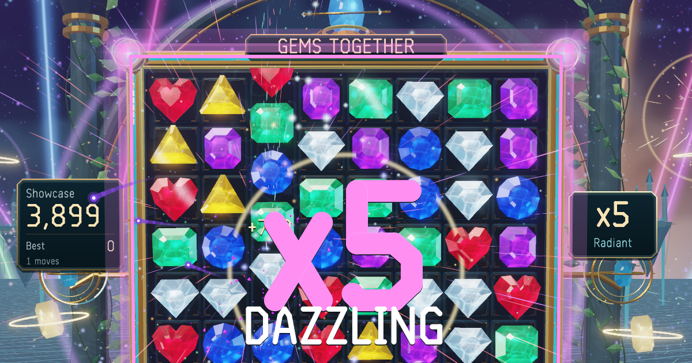

# Gems Together

**Match three with the people you love.**

Play it: **https://tront.xyz/gemstogether/**

A co-op match-three game on one shared 3D jewel board. Tap a gem and its neighbour, drag, or use a controller to line up three or more. Cascades chain into combos, and bigger matches forge charged gems: blast gems that detonate their surroundings and prisms that shimmer through the spectrum.

Open the normal link and you land in the public room, on the same board as everyone else playing right now, with their cursors and grabs showing live. Co-op Room makes a private code for just the two of you. Showcase lets the board play itself.

Journey remembers the stages you've visited and grows your cabinet treasury. Endless stays at the heart, alongside shared Timed, 30-move, puzzle and daily challenges. High fives, team Resonance, photo mode and a best-run ghost add ways to enjoy the board together. Stages blend into the next background without pausing play.

Built by Tront for Jennifer. Current version: 3.3.0.

## Tech

One HTML file. The cabinet, gems and the whole interface render on the GPU (WebGPU, WebGL2 fallback with `?webgl`). Co-op is peer to peer over WebRTC via [Trystero](https://github.com/dmotz/trystero) (loaded from a CDN); no server of ours. Scores, settings and your optional music track stay on your device.

`python tools/polish.py` builds the single HTML from the original drop plus the hosting extensions. `tools/verify.mjs` checks the original release gate on real GPU Chrome. The feature, network, visual and transition gates are `tools/expedition-audit.mjs`, `tools/expedition-network.mjs`, `tools/expedition-visual.mjs` and `tools/expedition-stage.mjs`. Tests use solo, private rooms or random isolated public rooms.

The [desktop wrapper](desktop/README.md) builds a portable Windows app with Steam preparation. Voice generation and the local listening page are documented in [tools/VOICE-AUDITIONS.md](tools/VOICE-AUDITIONS.md).

## Credits

By Tront (Trent Sterling), built with AI coding tools. More games at [tront.xyz/games](https://tront.xyz/games/) · [Discord](https://tront.xyz/discord/)

Trystero is MIT licensed, copyright Dan Motzenbecker.
