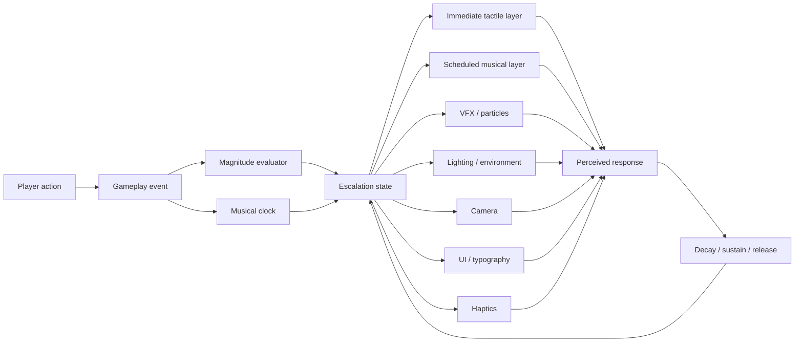
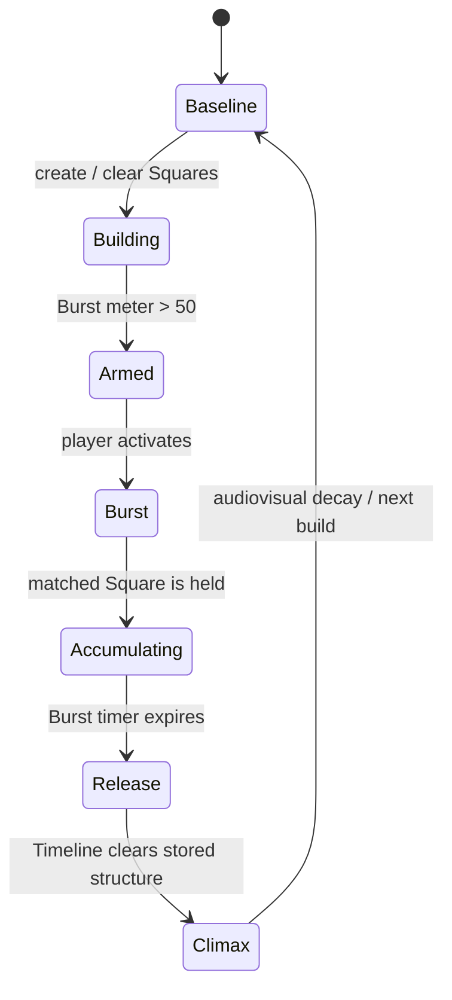
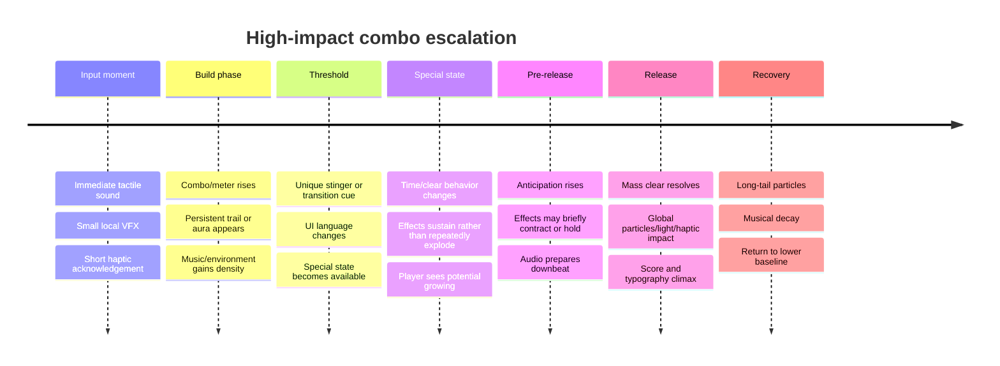

# Combo and Cascade Spectacle in Tetris Effect, Tetris Effect: Connected, Lumines, and Lumines Arise

## Executive summary

The strongest common design principle across **Tetris Effect**, **Tetris Effect: Connected**, the original **Lumines** lineage, and **Lumines Arise** is that spectacular combo feedback is **not primarily a bigger-number problem**. It is a **state-escalation and synchronization problem**.

The games increase the perceived importance of a successful sequence by changing several systems together: event sounds become part of the music; visual density rises; particles or environmental animation accumulate; important events occur on musically meaningful boundaries; the UI changes semantic vocabulary; and, at the highest levels, the *rules of presentation or even the rules of play change*. Tetris Effect's Zone and Lumines Arise's Burst are especially important because they convert an ordinary sequence of clears into an explicit **charge → transformation → build → release** structure. citeturn20view0turn16view3turn16view2

The deepest takeaway for a combo system is therefore:

> **Do not make 5× merely five times as loud as 1×. Make 5× cross a state boundary that 1× cannot access.**

Tetris Effect deliberately cycles between excitation and relaxation; Enhance described music and visuals as ramping up and down to induce flow, while simultaneously tuning effects so they did not obscure the playfield or become uncomfortable in VR. Most of its graphics were particle-based specifically because particles reacted well to music. The team even modified and optimized Unreal Engine 4's particle system to reach its visual target. citeturn20view0

Lumines solves the same problem differently. Its fundamental payoff is **temporally deferred**: completed Squares sit on the board until the Timeline sweeps through them. The original developers built the prototype around beat-by-beat synchronization with that Timeline, and described the player's actions as becoming synchronized with the music. The original timing model divided the field into 16 timeline sections corresponding to eighth notes, so a conventional 4/4 sweep spans two bars. Sound effects were treated not as decoration over the music but as material from which the musical experience itself was constructed. citeturn20view1

Lumines Arise then takes that latent Lumines principle and makes it explicit with **Burst**. Once the Burst meter is above 50, out of a maximum of 100, Burst can be triggered; matched material is temporarily prevented from clearing so that the player can grow a much larger Square, after which normal Timeline clearing resumes and the stored structure explodes into a large, high-scoring payoff. Enhance explicitly describes the result as “screen-clearing combos.” citeturn23search3turn16view2

Tetris Effect similarly gives high-end play a separate presentation state through Zone. The Zone meter charges through line clears; activating it stops time and prevents cleared lines from disappearing normally, letting the player accumulate unusually large clears. The game then assigns special vocabulary to exceptional results: at least 12 Zone lines is a **Dodecatris**, while 16 or more is a **Decahexatris**. That semantic change matters: the player is no longer merely seeing a higher score; the game tells them that they have achieved something belonging to a different category. citeturn16view3turn24view1

For implementation, the best architecture suggested by these games is a **central feedback-intensity state** rather than separate ad-hoc reactions in audio, particles, UI, camera and lighting. Gameplay produces an event magnitude; a musical clock determines when appropriate portions of the response should land; a feedback state machine determines the current escalation tier; individual presentation systems interpret that tier within independent resource budgets. Tetris Effect's documented cross-disciplinary music/visual iteration and Lumines' timeline-based synchronization strongly support that architecture, although no source located here publishes the actual internal code for either game. citeturn20view0turn20view1turn24view0

### The most transferable lessons

| Principle | Why it works | Strongest reference |
|---|---|---|
| **Reserve audiovisual headroom** | Ordinary successes cannot already consume maximum particle density, brightness, bass, camera movement and typography if exceptional successes need somewhere to go. | Tetris Effect deliberately cycles excitation and relaxation rather than staying maximally intense. citeturn20view0 |
| **Separate immediate feedback from delayed payoff** | Input remains responsive while a future synchronized event can become much bigger than any individual action. | Lumines places actions immediately but delays clear resolution to the Timeline. citeturn20view1turn20view4 |
| **Make high tiers change state, not merely amplitude** | A state transition creates anticipation and gives the climax unique audiovisual grammar. | Zone in Tetris Effect; Burst in Lumines Arise. citeturn16view3turn16view2 |
| **Synchronize modalities** | Sound, particles, lighting, UI, haptics and gameplay agreeing on one moment makes a payoff feel much larger than independently firing effects. | Tetris Effect's visuals/music were iterated against one another; Lumines Arise explicitly describes sight, sound and haptics merging. citeturn24view0turn16view2 |
| **Turn player actions into composition** | The player feels like a performer rather than a consumer of canned feedback. | Original Lumines composers describe SFX as integral to the soundtrack and player activity as synchronized with music. citeturn20view1 |
| **Give exceptional outcomes unique language** | Naming or typographically distinguishing a threshold makes it memorable and socially communicable. | Dodecatris and Decahexatris in Tetris Effect. citeturn24view1 |
| **Aggregate before releasing** | Temporal and spatial accumulation increases contrast between anticipation and payoff without spamming effects constantly. | Lumines Timeline, Tetris Effect Zone, Lumines Arise Burst. citeturn20view1turn16view3turn16view2 |

One caveat is crucial for the tables below: **the 1×–5× labels are a normalized analytical scale created for this report.** They are *not* claims that all four games implement hidden five-step combo multipliers. In fact, the absence of a rigid five-step audiovisual ladder is part of the lesson: these games often derive spectacle from **event magnitude, accumulated state, musical timing, spatial density and mode transitions simultaneously**, rather than from a single integer combo counter. citeturn20view0turn20view1


## Research frame and evidence quality

The source set was weighted toward developer statements and first-party material. The strongest technical source for Tetris Effect is Epic's interview with Enhance VP Mark MacDonald and Monstars technical director Takanori Uchida, because it directly discusses particle architecture, Unreal Engine tools, iteration, VR constraints and engine modification. citeturn20view0

For audio, Hydelic's PlayStation Blog post is unusually valuable. It documents how music was prototyped inside the game, how visual designers altered particles in response to music and the composers then changed audio again in response to those visuals. It also provides rare quantitative musical examples: exciting material tended toward **4/4 at approximately 135 BPM**, while calmer material tended toward **6/4 at approximately 100–120 BPM**. citeturn24view0

For original Lumines, the 2009 Game Developer interview with composer Takayuki Nakamura and director/designer Katsumi Yokota is the strongest located primary technical record. It directly describes the original prototype tools, multi-track audio design, the Timeline's beat subdivision, the relationship between sound effects and music, and changes made to interactive music rules in later entries. citeturn20view1

For Lumines Arise, the highest-confidence mechanical information comes from Enhance's launch material, the official Lumines site/community guide and PlayStation's official page. Enhance identifies the new Burst system, the 35-plus-stage audiovisual Journey, the composers and the integration of visual, audio and haptic presentation; the community guide provides the numeric Burst activation threshold. citeturn16view2turn23search3turn23search7

The research did **not** locate a public source-code release, full GDC engineering postmortem, internal FMOD/Wwise project, exact particle-count budget, audio voice budget, render-thread trace, or authoritative list of per-combo VFX thresholds for any of these titles. Where this report presents an implementation architecture or 1×–5× threshold curve, it is therefore explicitly a **reconstruction/recommendation derived from documented behavior**, not leaked or reverse-engineered production code.

### What “spectacle” means analytically

For comparison, spectacle can be decomposed into five largely independent variables:

\[
S \approx f(M, D, P, C, T)
\]

where:

- **M — event magnitude:** lines/Squares/blocks resolved, combo depth, attack value or scoring consequence.
- **D — audiovisual density:** concurrent particles, transient events, light changes, environmental motion and sound layers.
- **P — persistence:** how long the successful state remains visible or audible.
- **C — cross-modal coherence:** how tightly sound, visuals, haptics and UI land together.
- **T — temporal contrast:** how much anticipation or quiet exists before the payoff.

That model explains why a very short, synchronized Burst release may feel larger than continuously throwing thousands of particles at every clear. The high-value variable is often **contrast**, not raw effect count. Tetris Effect's documented excitation/relaxation cycles and Lumines' deferred Timeline resolution strongly support this interpretation. citeturn20view0turn20view1

A useful implementation model is:



The distinction between **immediate tactile layer** and **scheduled musical layer** is especially important. A rotation, placement or collision can acknowledge the player immediately, while a major clear, stage pulse, musical accent or environmental response can wait for a musically coherent boundary. Original Lumines effectively builds that separation directly into its game rules via the Timeline. citeturn20view1


## Tetris Effect and Tetris Effect: Connected

### Feedback is part of the world, not an overlay

Tetris Effect's official description says its Journey stages each have their own theme, graphics, music and sound effects, with those elements synchronized to gameplay. Enhance's technical interview goes further: **particles were selected as the basis for most of the graphics because they could react well to music**. This is a fundamental architectural decision, not a late-stage “juice” pass. citeturn16view3turn20view0

The important distinction is that an ordinary Tetrimino action and a large success are both speaking through the **same audiovisual world model**. Escalation therefore does not feel like a UI system suddenly spawning a generic “COMBO!” prefab over the game. The surrounding scene itself participates.


*Official Tetris Effect screenshot showing the Zone gauge and particle-dense environmental presentation.* citeturn22view1turn16view3

Enhance also deliberately protected the baseline. MacDonald says the team designed cycles of excitement and relaxation, with both music and visuals ramping up and down, and spent substantial time ensuring the spectacle did not produce nausea or obscure gameplay; a reduced-effects option was included. citeturn20view0

That is probably the single most relevant answer to “why does a huge combo feel huge?”:

**Because the game is willing to be less huge immediately beforehand.**

### Audio layering and musical intensity

Hydelic's documented workflow was iterative rather than linear. A rough musical demo was implemented; designers adjusted visual elements to match it; particle movement then influenced further musical adjustments. The Deep Sea opening stage alone went through **more than ten musical tracks/prototypes**, moving from ambient material without vocals, to beat-driven material, to experiments with male and female vocals. citeturn24view0

The composer reports a repeatable tempo/emotional relationship:

| Intended state | Documented tendency |
|---|---:|
| Excitement | ~135 BPM, 4/4 |
| Calm | ~100–120 BPM, 6/4 |

citeturn24view0

At 135 BPM, one quarter-note beat lasts roughly **444 ms** and an eighth note roughly **222 ms**. That is enough temporal resolution to align visually salient changes with subdivisions while still making the game feel immediate. The exact quantization rules used internally are not publicly documented, but the tempo figures demonstrate that tempo itself was being treated as an emotional-design variable rather than as background decoration. citeturn24view0

For a combo-feedback implementation, that suggests keeping at least two audio channels conceptually separate:

```text
IMMEDIATE
rotate / land / lock / local clear acknowledgment
          |
          +------ no perceptible latency

MUSICAL
combo accent / stem change / environmental pulse / climax
          |
          +------ schedule to nearest musically valid subdivision
```

That specific architecture is a recommendation, not confirmed Tetris Effect source code, but it preserves the documented relationship between responsive play and synchronized audiovisual change. citeturn24view0turn20view0

### Zone creates the macro-escalation state

Zone is more important to spectacle than an ordinary combo counter because it changes the temporal rules.

Clearing lines charges a Zone meter. Activating Zone stops time and falling pieces; lines cleared while active are moved to the bottom instead of immediately resolving, which lets the player continue stacking and build extraordinary clears. citeturn16view3

The escalation then gains **semantic thresholds**:

- At least **12** lines cleared during Zone is a **Dodecatris**.
- **16 or more** is a **Decahexatris**. citeturn24view1

This is excellent feedback design because the climax is reinforced simultaneously by:

**mechanical consequence → accumulated board state → time manipulation → audiovisual state → special typography/name → score reward.**

The game does not need to make every ordinary four-line clear deafening because it has a structurally distinct upper tier available.

### Connected adds social and spatial scale

Tetris Effect: Connected extends the same logic from one matrix to several. In Connected mode, three players fight an AI boss; when the team enters Zone, their matrices connect and they clear lines together to inflict large damage. citeturn16view3

That creates another escalation axis unavailable to single-player feedback:

\[
\text{personal success} \rightarrow
\text{shared timing} \rightarrow
\text{spatial merge} \rightarrow
\text{team payoff}
\]

The presentation can become spectacular without merely increasing brightness because **the topology of the play space changes**.

Connected also makes rhythm mechanically explicit in revival: a defeated player taps rotation buttons to the beat of a clap to fill a revive meter, while teammates contribute through Tetrises and T-spins. citeturn16view4

### Particle and rendering implementation

Tetris Effect used **Unreal Engine 4**. Technical director Takanori Uchida specifically cited the Material Editor and particle editor as enabling faster artist iteration; the team used UE4's source availability to **enhance and optimize the particle system** for its desired visuals. Blueprints and the Material Editor were identified as favored tools. The core team size was roughly 15 people, varying with contractors. citeturn20view0

The production implication is significant: spectacle-heavy feedback was important enough that the developers modified the engine's particle path rather than treating the stock system as a fixed constraint. citeturn20view0

Yet scalability remained mandatory. Current support material lists 4K/60 fps on Xbox Series X, 1440p/60 fps on Series S, additional graphical options on Windows, and explicit **Performance/Fidelity** graphics modes on newer Quest hardware. citeturn16view4

So the actual philosophy is not “spawn everything.”

It is closer to:

> **Make spectacle a first-class rendering system, then aggressively preserve its perceptual shape across quality tiers.**

A high tier does not necessarily require four times the particles. It needs the *perception* of a qualitatively larger event.

### Normalized Tetris Effect escalation

| Analytical tier | Gameplay threshold analogue | Audio | Particles / lighting | UI / camera / state |
|---|---|---|---|---|
| **1×** | Normal placement or modest clear | Local action cue; musical baseline remains dominant | Localized response only | Playfield stays visually authoritative |
| **2×** | Stronger clear / repeated success | Stronger accent or denser event response | More local density and persistence | Small UI scoring response |
| **3×** | Sustained success and meaningful Zone charge | Musical/environmental intensity has room to rise | Background joins the event more noticeably | Player senses mounting potential |
| **4×** | **Enter Zone** | State-change cue; normal time relation is interrupted | Environment/board enter distinct special-state treatment | Time stops; Zone becomes mechanically explicit |
| **5×** | Exceptional Zone resolution, especially **12+/16+ lines** | Climax rather than another ordinary clear sound | Peak spatial density can be concentrated at release | Dodecatris/Decahexatris vocabulary makes achievement categorically special |

The 1×–3× audiovisual distinctions above are analytical categories rather than documented hardcoded thresholds. Zone and its large-clear naming thresholds are documented. citeturn16view3turn24view1


## Lumines lineage and Lumines Arise

### Original Lumines makes time itself the combo presentation system

The defining Lumines insight is that matched Squares do not simply disappear the instant they are created. A vertical **Timeline** continuously sweeps left to right, and the clear occurs as that line reaches completed Squares. Modern official descriptions retain this structure: the Timeline sweeps to the beat, clearing completed Squares and awarding points; higher tempo gives the player less time to build combinations before the sweep arrives. citeturn20view4

That rule creates spectacle naturally.

Suppose the player produces five valid Squares over two seconds. A conventional match game might fire five medium-size effects:

```text
pop    pop  pop       pop pop
```

Lumines can accumulate them and resolve them spatially along a shared temporal conductor:

```text
BUILD:    [■■] [■■■■] [■■] [■■■■■■]

TIMELINE: |--------->

RELEASE:  *   **    ***    ****
          ^ all rhythmically related
```

The result is perceived as an event rather than five independent acknowledgments.

### The original timing model is unusually measurable

Katsumi Yokota describes building the prototype “beat by beat” around the Timeline. In the interview's technical explanation, the field is divided into **16 sections**, Timeline movement synchronizes to **eighth notes**, and 16 eighth notes correspond to **two measures of 4/4**. citeturn20view1

That yields a useful relationship:

\[
T_{sweep} = \frac{480}{BPM}\text{ seconds}
\]

for the stated two-bar 4/4 model.

Examples:

| BPM | Eighth-note subdivision | Full 16-section sweep |
|---:|---:|---:|
| 100 | 300 ms | 4.80 s |
| 120 | 250 ms | 4.00 s |
| 135 | ~222 ms | ~3.56 s |
| 150 | 200 ms | 3.20 s |

The original series can therefore alter not merely music speed but the player's **combo construction window** through BPM. Lumines Remastered's official description explicitly says faster tempos provide less time to make combos, whereas slower songs allow uncleared material to accumulate. citeturn20view1turn20view4

This makes tempo simultaneously:

1. a musical parameter,
2. a difficulty parameter,
3. an anticipation-duration parameter,
4. and a feedback-frequency parameter.

That is far richer than simply increasing music BPM when a combo goes up.

### Sound effects are components of the composition

The original Lumines prototype was built using **Fruity Loops and Cubase** for music and Adobe Photoshop for graphics. Yokota says he focused heavily on sound effects and constructed the music primarily to supplement them; the prototype used multiple audio tracks and ambient effects. citeturn20view1

He also describes the sound effects as being effectively integrated into the musical design. Nakamura and Yokota's broader characterization is that playing Lumines can feel closer to playing a musical instrument because the player's activities become synchronized with the music. citeturn20view1

That suggests a fundamentally different audio model from:

```csharp
if (combo > 4)
    Play("big_combo.wav");
```

A more Lumines-like model is:

```text
PLAYER ACTION
    ↓
musically compatible one-shot / motif
    ↓
joins running rhythm
    ↓
Timeline resolves accumulated geometry
    ↓
several event sounds form a phrase
```

In other words, **the game does not stop the music to congratulate the player; the player's success becomes music.**

### The original series learned not to over-couple everything

An especially useful negative lesson comes from the same developer interview. In the earliest implementation, background music would not progress unless the player eliminated at least one block on each Timeline sweep. The team later abandoned that approach because it interfered with the composition. citeturn20view1

That is an important warning for adaptive-combo systems:

> **Interactivity should modify musical expression without making the music hostage to mediocre play.**

A soundtrack that literally stalls whenever the player performs poorly may be highly interactive yet musically awful.

The later Lumines design therefore moves toward **stable musical structure + interactive contributions**, rather than allowing the player's event stream to destroy the track's form. citeturn20view1

### Skins act as macro-state transitions

Original Lumines development paired visual “skins” with music. The first game's tracks and skins were designed in parallel, with visual and audio creators repeatedly passing ideas back and forth; in Lumines Live! and Lumines II, skin design often came first and provided more concrete direction for the music. citeturn20view1

This means the largest escalation is not necessarily the combo counter at all. There are at least three nested timescales:

```text
milliseconds     input feedback
seconds          Timeline sweep / combo resolution
minutes          skin / track / presentation transition
```

A modern combo system benefits from the same hierarchy. The 5× event should feel large locally, but the game should also be able to preserve larger “chapter” or “stage” crescendos above it.

### Lumines Arise turns deferred payoff into Burst

Lumines Arise retains the 2×2-block and Timeline foundation but adds Burst as an explicit high-order state. Enhance describes Burst as follows: trigger Burst to stop a matched Square from clearing, grow it as large as possible until time expires, and then let the Timeline resume, producing screen-clearing combos and large scores. citeturn16view2

The official community guide gives the threshold: once the Burst meter rises **above 50**, with **100** as maximum, the player can activate Burst. citeturn23search3

That is nearly an ideal escalation loop:



Notice that **the climax begins before anything explodes**.

The moment the player crosses the threshold, there is potential.

The moment they activate Burst, there is a state transition.

During Burst, there is anticipation.

Only afterward is there release.

That gives artists and audio designers four separate emotional beats to score instead of one.

### Arise broadens the modal stack

Enhance describes Lumines Arise as more than 35 stages where sound, visuals and puzzle play are synchronized; director/art director Takashi Ishihara specifically describes sight, sound and **haptic feedback** merging. The soundtrack is by Hydelic and Takako Ishida. citeturn16view2turn23search7


*Official PlayStation Lumines Arise announce trailer; the game is presented as a synesthetic fusion of sound, light and puzzle play.* citeturn23search10turn23search7

The critical improvement over the older presentation stack is haptics. A high-tier event can now escalate across:

\[
\text{audio} +
\text{particles} +
\text{lighting} +
\text{environment} +
\text{UI} +
\text{haptics}
\]

rather than simply increasing screen-space effects. Enhance explicitly calls attention to that multimodal combination. citeturn16view2

Lumines Arise supports PS5/PC and optional PS VR2/SteamVR, while Enhance also advertises 4K presentation. citeturn16view2 A Japanese developer interview available through Livedoor identifies the project as using Unity; however, because the accessible English first-party materials examined here do not themselves specify the engine, that engine attribution should be treated as less authoritative than the directly documented UE4 attribution for Tetris Effect. citeturn6search16

### Normalized Lumines escalation

| Analytical tier | Original Lumines analogue | Lumines Arise analogue | Presentation meaning |
|---|---|---|---|
| **1×** | One Square prepared / ordinary Timeline clear | Ordinary Square | Immediate action feedback stays restrained enough to remain musical |
| **2×** | Several Squares pending in one sweep | Dense multi-Square clear | More events occur inside one musical phrase |
| **3×** | Sustained clear density over consecutive sweeps | Strong chain + rising Burst meter | Persistence signals that the player is cooking |
| **4×** | No universal special mode in original lineage; high density remains emergent | **Burst armed/activated above 50 meter** | State transition announces that ordinary rules are temporarily suspended |
| **5×** | Exceptional mass-clear / sustained chain | **Burst release after enlarged Square construction** | Deferred material resolves in a concentrated screen-clearing climax |

The original games do not expose a universal five-step VFX ladder in the primary development record; the upper tiers there are emergent from **how much spatial material the player has arranged for the same Timeline sweep**. Arise formalizes the “hold and release” concept through Burst. citeturn20view1turn16view2turn23search3


## Cross-game escalation model

### Side-by-side normalized ladder

The most useful handoff table is not “what particle does each game spawn at combo three?” because the source material does not expose such a table. It is instead **what qualitative privilege becomes available at each escalation level**.

| Tier | Tetris Effect | Connected | Original Lumines series | Lumines Arise |
|---|---|---|---|---|
| **1× — acknowledge** | Local action/clear response inside stage audiovisual language | Same individual baseline | Placement/Square response becomes part of track | Same, plus modern haptics |
| **2× — reinforce** | More meaningful line-clear event | Individual success can contribute to team state | Several Squares create a denser upcoming Timeline phrase | Several Squares make a denser multisensory phrase |
| **3× — sustain** | Zone meter/presentation potential accumulates | Team progress creates anticipation | Success persists across sweeps; rhythm and clear density become performance | Burst meter makes future transformation visible |
| **4× — transform** | Enter **Zone**; time behavior changes | Matrices can connect during team Zone | Primarily emergent rather than explicit | Enter **Burst**; matched material is deliberately retained |
| **5× — climax** | Huge Zone clear; special achievement vocabulary | Combined team line clear damages boss at group scale | Dense synchronized Timeline sweep / extended chain | Burst ends and stored structure resolves as screen-clearing combo |

Documented Zone, Connected and Burst behaviors support the upper-state mappings. citeturn16view3turn16view2turn23search3

### Modality escalation

| Attribute | Low tier | Middle tier | Peak tier | Best exemplar |
|---|---|---|---|---|
| **Audio layering** | Tactile one-shots | More player-generated material contributes rhythmically | Musical/state climax | Original Lumines; Tetris Effect citeturn20view1turn24view0 |
| **Particles** | Local | More persistent/environmental | Scene-scale synchronized event | Tetris Effect explicitly uses particles as core graphics. citeturn20view0 |
| **Lighting** | Stable readable baseline | Rhythmic modulation | State-specific global treatment | Tetris Effect's visuals intentionally ramp with music. citeturn20view0 |
| **Camera** | Avoid disrupting precision | Gentle environmental motion | Use sparingly; state/world change is preferable to violent shake | Tetris Effect development explicitly balanced spectacle against nausea and obstruction. citeturn20view0 |
| **UI / typography** | Score acknowledgement | Combo/meter communicates momentum | Unique naming and state presentation | Dodecatris / Decahexatris. citeturn24view1 |
| **Timing** | Immediate tactile response | Beat-aligned reinforcement | Bar/Timeline-aligned climax | Lumines' 16-eighth-note sweep. citeturn20view1 |
| **State transition** | None | Prepare meter | Special mode | Zone / Burst. citeturn16view3turn16view2 |
| **Haptics** | Tap/pulse | Rhythmic pattern | Sustained or multi-stage climax | Lumines Arise explicitly foregrounds haptic integration; Lumines Remastered also supports synchronized multi-controller “Trance Vibration.” citeturn16view2turn20view4 |

### The key timing timeline

A generalized escalation timeline extracted from these designs looks like this:



The particularly strong design move is **pre-release contraction**. Neither source set documents a universal literal “duck all effects for 100 ms” implementation, so that part is a recommendation rather than a claim about shipped code. But it follows the same contrast principle as Tetris Effect's excitation/relaxation cycles and Lumines' delayed clear structure. citeturn20view0turn20view1

### A proposed 1×–5× specification for a new game

For a system explicitly targeting the feeling **“holy shit, I got a 5× combo”**, I would use the following budget rather than linear multiplication:

| Tier | Event treatment | Audio | VFX / lighting | UI | Persistence |
|---|---|---|---|---|---|
| **1×** | Confirmation | 1 tactile one-shot | 1× local budget | Small numeral | ~0.25–0.5 s |
| **2×** | Reinforcement | alternate/higher-energy sample | ~1.25× local budget | Numeral scales/pulses | ~0.5–0.75 s |
| **3×** | Momentum | add rhythmic layer or harmony | ~1.5–1.75× plus persistent trail | Combo becomes persistent | ~1–2 s |
| **4×** | Transformation warning | stinger + mix shift | ~2×, environmental lights join | Typography/state banner | held while chain survives |
| **5×** | **Unique climax** | unique phrase, short mix duck then impact | ~2.5–3× perceptual budget, scene-scale burst | bespoke wording/animation | 2–4 s tail |

Those numbers are **recommended relative envelopes**, not budgets extracted from Enhance.

The essential thing is that 5× has **exclusive assets**. Merely multiplying emission rate and volume is the cheap version.

A real 5× deserves something unavailable at 1×:

- exclusive audio phrase,
- global light pulse,
- background/environment reaction,
- unique typography,
- long-tail particle state,
- possibly slow-time or short presentation hold,
- distinct haptic envelope.

That principle directly mirrors how Zone and Burst reserve mechanics and audiovisual presentation for extraordinary states. citeturn16view3turn16view2


## Implementation blueprint

### Centralize intensity instead of hard-wiring each subsystem

A robust implementation should turn gameplay into a semantic feedback event first:

```csharp
public readonly record struct FeedbackEvent(
    int ComboDepth,
    int UnitsCleared,
    float Meter01,
    bool EnteredSpecialState,
    bool ExitedSpecialState,
    double EventTime
);
```

Then derive a bounded intensity value rather than allowing raw combo size to scale every effect linearly:

```csharp
static float ComputeIntensity(in FeedbackEvent e)
{
    // Example only: weights should be tuned from capture/playtest data.
    float combo = MathF.Log2(1f + e.ComboDepth) / 3f;
    float mass  = MathF.Sqrt(MathF.Max(0, e.UnitsCleared)) / 4f;
    float meter = e.Meter01;

    float stateBonus =
        e.ExitedSpecialState  ? 0.35f :
        e.EnteredSpecialState ? 0.20f : 0f;

    return Math.Clamp(
        combo * 0.40f +
        mass  * 0.35f +
        meter * 0.25f +
        stateBonus,
        0f,
        1f);
}
```

The logarithm/square root deliberately prevents a large combo from requesting a literally proportional number of particles or simultaneous sounds.

Tiering then needs hysteresis:

```csharp
enum FeedbackTier
{
    Acknowledge = 1,
    Reinforce,
    Momentum,
    Transform,
    Climax
}

static readonly float[] UpThresholds =
{
    0.00f, 0.18f, 0.38f, 0.62f, 0.82f
};

// Down-thresholds should be lower than up-thresholds
// so the presentation does not flicker between tiers.
```

This is recommended architecture, not disclosed code from any researched game.

### Give the musical clock authority over some, but not all, feedback

The original Lumines material argues strongly for a global music clock. Its Timeline itself is beat-synchronized, with the original design described in eighth-note subdivisions. citeturn20view1

A practical API could be:

```csharp
public interface IMusicalClock
{
    double DspTime { get; }

    double NextSubdivision(int divisionsPerBeat);
    double NextBeat();
    double NextBar();
}
```

Then split an event:

```csharp
void HandleCombo(FeedbackEvent e)
{
    float intensity = ComputeIntensity(e);
    FeedbackTier tier = tierState.Update(intensity);

    // Never make basic control feedback feel laggy.
    tactileAudio.PlayImmediate(e, tier);
    localVfx.PlayImmediate(e, tier);

    // Bigger "musical" consequences may wait a tiny amount.
    double hitTime = tier switch
    {
        FeedbackTier.Acknowledge => musicClock.DspTime,
        FeedbackTier.Reinforce   => musicClock.NextSubdivision(2),
        FeedbackTier.Momentum    => musicClock.NextBeat(),
        FeedbackTier.Transform   => musicClock.NextBeat(),
        FeedbackTier.Climax      => musicClock.NextBar(),
        _                         => musicClock.DspTime
    };

    musicFeedback.Schedule(e, tier, hitTime);
    environment.Schedule(e, tier, hitTime);
    globalVfx.Schedule(e, tier, hitTime);
    haptics.Schedule(e, tier, hitTime);
}
```

A production game should cap how long a result is allowed to wait. A musical downbeat that occurs 900 ms later is not worth making the game feel broken. Lumines avoids this conflict elegantly because the delay is itself a visible game rule: the player can literally see the Timeline approaching. citeturn20view1

That yields a powerful general rule:

> **When feedback is delayed for synchronization, visualize the delay.**

Meters, sweeps, charging glows, a closing ring, a descending beat marker or a visibly approaching timeline convert latency into anticipation.

### Audio should escalate by arrangement, not loudness

The original Lumines developers explicitly constructed music around multiple tracks and sound effects, while Tetris Effect used repeated audio/visual iteration rather than treating soundtrack and gameplay feedback independently. citeturn20view1turn24view0

A new system should therefore expose something like:

```text
Tier 1
  base track
  local SFX

Tier 2
  base track
  varied/percussive SFX

Tier 3
  + rhythmic stem
  + longer success motif

Tier 4
  + harmonic / bass / texture stem
  + state-transition sound

Tier 5
  short pre-hit space
  + climax phrase
  + strongest compatible SFX
  + controlled long tail
```

The mix must retain headroom. If the base soundtrack, placement SFX and 1× clear are already hitting the limiter, the 5× event can only become more distorted rather than more spectacular.

A useful audio-budget implementation is priority-based voice stealing:

```csharp
priority =
    10 * (int)tier +
     4 * eventMagnitude +
     8 * isStateTransition +
    12 * isClimax;
```

Low-priority repetitive one-shots can be dropped during a climax while the highest-value transient and musical phrase remain pristine.

### Particle escalation should change morphology

Tetris Effect's team chose particles as a fundamental graphics primitive and optimized UE4's particle system to support the target look. citeturn20view0

The transferable lesson is not “more particles at each tier”; it is **different spatial behavior**:

| Tier | Better change than raw count |
|---|---|
| 1× | small localized burst |
| 2× | wider directionality / extra secondary particles |
| 3× | longer trails, persistence and background echoes |
| 4× | scene/environment emitter activates |
| 5× | coherent global wave, radial field, vortex, bloom pulse or world transformation |

That avoids \(O(N)\) visual spam as the number of simultaneous clears grows.

For a mass cascade, aggregate adjacent events:

```csharp
var groups = ClusterEvents(clearEvents,
                           maxSpatialDistance: 2.0f,
                           maxTimeDistance: 0.075f);

foreach (var group in groups)
{
    // One meaningful emitter can look better and cost less
    // than 30 identical emitters occupying the same pixels.
    vfx.EmitAggregated(
        center: group.WeightedCenter,
        energy: Compress(group.TotalEnergy));
}
```

This is particularly relevant to a Lumines-style sweep, where many adjacent Squares may resolve in a short interval.

### Camera should be the last escalation channel, not the first

Tetris Effect's developers explicitly tuned effects around nausea and playfield obstruction, especially because the same experience had to work in VR, and they supplied reduced-effects settings. citeturn20view0

For precision puzzle gameplay, the visual hierarchy should therefore be approximately:

\[
\text{local VFX}
\rightarrow
\text{environment}
\rightarrow
\text{lighting}
\rightarrow
\text{UI}
\rightarrow
\text{camera}
\]

rather than immediately applying giant camera shake.

For VR in particular, world animation and peripheral particles can communicate scale without violating camera stability.

### Treat state transitions as resource-budget opportunities

A clever benefit of Zone/Burst-style special states is that the game can change *which* resources it spends instead of only spending more.

During anticipation:

- ordinary emitters can become quieter,
- low-priority audio can be suppressed,
- background animation can slow,
- exposure can contract slightly,
- particles can converge rather than spawn explosively.

At release, the game spends the saved perceptual headroom on one coherent event.

This is effectively **perceptual dynamic range management**.

Tetris Effect's excitation/relaxation design and configurable effect intensity support the underlying principle, even though these exact implementation steps are recommendations. citeturn20view0

### Resource budget matrix

Exact shipped budgets are not public, so this is the recommended instrumentation set for reproducing the design rigorously:

| Resource | Measure | Hard guardrail |
|---|---|---|
| CPU VFX | spawn/update µs | tier budget + global cap |
| GPU particles | active particles, overdraw, transparent pixels | resolution/VR-specific cap |
| Lighting | dynamic-light count, fullscreen passes | maximum per quality level |
| Audio | active voices, DSP %, peak/RMS/LUFS | voice stealing + reserved climax voices |
| UI | animations / layout rebuilds | pre-pooled, avoid allocation |
| Haptics | amplitude/duty cycle | comfort envelope |
| Camera | displacement / FOV / angular motion | stricter VR envelope |
| Screen occupancy | % of playfield occluded | gameplay readability ceiling |
| Luminance | average/peak change | accessibility/compliance limit |

Tetris Effect's published platform configuration demonstrates why this must scale: it spans VR and flat-screen platforms, exposes performance/fidelity options on Quest and targets different console output resolutions while retaining the same overall artistic language. citeturn16view4


## Capture plan, prioritized sources, and Claude handoff

### Recommended empirical capture dataset

The source material answers **why** the systems work better than it answers exact frame-level numbers. The next research pass should therefore turn the games themselves into datasets.

The highest-value experiment is to capture each title at 60 fps or above with lossless or very high-bitrate video and separate audio, then annotate:

```text
event timestamp
combo / clear magnitude
special-state value
Timeline / beat phase
first visual response frame
peak particle density frame
peak luminance
UI appearance/disappearance
camera transform delta
audio transient timestamp
audio RMS / spectral change
haptic event, where measurable
decay completion
```

The resulting data will distinguish “five effects happen together” from “the event truly has a designed envelope.”

#### Capture targets

| Game / source | Capture target | Measurement to extract | Link |
|---|---|---|---|
| **Tetris Effect** | Ordinary line clear → Tetris → Zone activation → large Zone release | effect occupancy, audio transient strength, persistence, state-transition duration | `https://www.youtube.com/watch?v=PFVL6t8IHE8` citeturn4search10 |
| **Tetris Effect** | Dodecatris / Decahexatris | exact frame where terminology appears; difference from ordinary clear | PlayStation article contains labelled examples: `https://blog.playstation.com/2018/06/25/tetris-effect-adds-a-new-strategic-layer-to-the-decades-old-game-and-it-works/` citeturn24view1 |
| **Connected** | First three-player matrix merge and subsequent team clear | camera/world transition, sound layering, boss-damage timing | Official 7:05 explainer: `https://www.youtube.com/watch?v=UzJA2KnUDv0` citeturn21search8turn16view3 |
| **Lumines Remastered** | Same skin: one Square vs many Squares in one sweep | clear transient count, spatial sequencing, sweep duration | `https://store.steampowered.com/app/851670/LUMINES_REMASTERED/` citeturn20view4 |
| **Lumines Remastered** | Slow skin vs fast skin | measured BPM, Timeline sweep duration, available build window | Same Steam capture; official description explicitly links tempo to combo time. citeturn20view4 |
| **Lumines Arise** | Normal multi-Square clear | baseline audiovisual budget | `https://www.youtube.com/watch?v=SwuqiVNs058` citeturn23search10 |
| **Lumines Arise** | Meter crosses 50 → Burst activation → build → Burst release | all transition timestamps, particle density, lighting, UI, haptic envelope | Official guide + gameplay capture: `https://lumines.game/community/` citeturn23search3 |
| **Lumines Arise** | Expert gameplay maintaining repeated high-value clears | whether audio layering follows chain depth or primarily stage state | Official improvement video: `https://www.youtube.com/watch?v=ZhrpDkIxly0` citeturn18search33 |
| **Lumines Arise** | Launch-trailer Burst spectacle | identify hero shots for reference board | `https://www.youtube.com/watch?v=HVRIvW5mNYk` citeturn16view2 |

I have **not fabricated frame timestamps** for YouTube footage that could not be played frame-accurately through the research interface. The official Connected video is known to be 7:05 long from Enhance's playlist metadata, but exact event offsets should be established in the capture pass rather than guessed. citeturn21search8

For a rigorous Claude follow-up, every source clip should receive a local timecode sheet such as:

```csv
game,video,event,start,end,notes
TetrisEffect,...,ordinary_clear,...
TetrisEffect,...,zone_enter,...
TetrisEffect,...,dodecatris,...
Connected,...,matrix_merge,...
Lumines,...,single_square_sweep,...
Lumines,...,mass_square_sweep,...
LuminesArise,...,burst_meter_50,...
LuminesArise,...,burst_enter,...
LuminesArise,...,burst_release,...
```

### Audio assets worth isolating

Do **not** only capture soundtrack stems. The crucial comparison is between **music without player interaction and music plus the action-generated layer**.

For each game, produce:

| Asset | Purpose |
|---|---|
| 30–60 s idle/minimal-interaction reference | Establish musical baseline |
| Individual placement/rotation sounds | Determine pitch/rhythm variation |
| Single clear | Establish 1× transient |
| Dense same-window clear | Test summing, compression and voice management |
| Special-state entry | Identify unique stinger/mix change |
| Special-state sustain | Detect added stems/filtering/environment |
| Special-state release | Measure peak transient and tail |
| Post-climax recovery | Determine how quickly headroom is restored |

This is particularly important for Lumines because its creators explicitly describe sound effects as components of the musical construction, and for Tetris Effect because Hydelic describes iterative balancing between particles and music. citeturn20view1turn24view0

### Particle and visual assets worth capturing

Capture alpha-friendly or black-background examples where possible:

- ordinary clear emitter;
- sustained-chain emitter;
- special-state aura;
- environmental pulse;
- climax burst;
- post-impact trailing particles;
- lighting-only response;
- UI-only recording;
- reduced-effects/performance-mode comparison;
- VR versus flat-screen comparison.

Tetris Effect is especially useful here because its particle-centric rendering approach and reduced-effects/scalability requirements are directly documented. citeturn20view0turn16view4

### Prioritized source list

| Priority | Source | Why it matters | Link |
|---|---|---|---|
| **Critical** | Epic / Unreal developer interview with Enhance and Monstars | Best source for Tetris Effect particle architecture, UE4, iteration, VR/readability and resource philosophy | `https://www.unrealengine.com/developer-interviews/how-tetris-effect-became-a-modern-work-of-art` citeturn20view0 |
| **Critical** | Game Developer interview with Nakamura & Yokota | Best primary source for original Lumines timing, prototype tools, interactive music and SFX philosophy | `https://www.gamedeveloper.com/game-platforms/interview-nakamura-yokota-on-the-origins-of-i-lumines-supernova-i-` citeturn20view1 |
| **Critical** | Hydelic on Tetris Effect soundtrack creation | Quantitative BPM examples and direct description of audio/visual iteration | `https://blog.playstation.com/2020/05/28/inside-the-creation-of-tetris-effects-original-soundtrack-out-today/` citeturn24view0 |
| **Critical** | Official Tetris Effect: Connected game guide | Zone rules, Journey synchronization, Connected matrix merging | `https://www.tetriseffect.game/connected/` citeturn16view3 |
| **Critical** | Enhance Lumines Arise launch material | Burst definition, audiovisual/haptic goals, soundtrack and platform details | `https://enhance-experience.com/17797` citeturn16view2 |
| **High** | Lumines Arise Community Guide | Numeric Burst threshold, directly useful for state-machine reconstruction | `https://lumines.game/community/` citeturn23search3 |
| **High** | PlayStation Tetris Effect Zone preview | Dodecatris/Decahexatris thresholds and early Zone explanation | `https://blog.playstation.com/2018/06/25/tetris-effect-adds-a-new-strategic-layer-to-the-decades-old-game-and-it-works/` citeturn24view1 |
| **High** | Lumines Remastered Steam material | Current official explanation of Timeline/BPM relationship and Trance Vibration | `https://store.steampowered.com/app/851670/LUMINES_REMASTERED/` citeturn20view4 |
| **High** | Tetris Effect support | Performance/Fidelity settings, platform targets and recording policy | `https://www.tetriseffect.game/support/` citeturn16view4 |
| **High** | Official Connected explainer playlist | Clean capture source for multiplayer state transitions | `https://www.youtube.com/playlist?list=PL9ox7RxhsJuTdh25SgYAE4Hd9Cz304Rmc` citeturn21search8 |
| **High** | Lumines Arise official announce trailer | Clean high-bitrate reference for visual escalation | `https://www.youtube.com/watch?v=SwuqiVNs058` citeturn23search10 |
| **Useful** | Lumines Arise official “How to Improve” video | Longer gameplay material for chain analysis | `https://www.youtube.com/watch?v=ZhrpDkIxly0` citeturn18search33 |
| **Useful** | Official Lumines Arise PlayStation page | Concise first-party description of every combo/beat as multisensory event | `https://www.playstation.com/en-us/games/lumines-arise/` citeturn23search7 |

No game-specific peer-reviewed paper located in this research pass exposed low-level feedback thresholds, particle budgets or adaptive-audio implementation at a level superior to these developer interviews. The best evidence for implementation is therefore the developer technical material above, supplemented by instrumented gameplay capture rather than speculation.

### Claude handoff

```yaml
handoff:
  research_question:
    goal: >
      Determine how Tetris Effect, Tetris Effect: Connected,
      original-series Lumines, and Lumines Arise make escalating
      combos/cascades feel spectacular, then translate the findings
      into an implementable feedback system.

  highest_confidence_findings:
    - finding: >
        Tetris Effect intentionally cycles excitation and relaxation;
        music and visuals ramp rather than remaining at maximum intensity.
      source: https://www.unrealengine.com/developer-interviews/how-tetris-effect-became-a-modern-work-of-art

    - finding: >
        Most Tetris Effect graphics were particle-based because particles
        react well to music. The team modified/optimized UE4's particle
        system and relied heavily on Material Editor, particle tools,
        and Blueprints.
      source: https://www.unrealengine.com/developer-interviews/how-tetris-effect-became-a-modern-work-of-art

    - finding: >
        Tetris Effect audio/visual production was iterative:
        music changed visuals, particle movement changed music again.
        Excitement tended toward ~135 BPM 4/4; calm toward
        ~100-120 BPM 6/4.
      source: https://blog.playstation.com/2020/05/28/inside-the-creation-of-tetris-effects-original-soundtrack-out-today/

    - finding: >
        Zone converts ordinary line clearing into a special accumulation
        state. 12+ Zone lines is Dodecatris; 16+ is Decahexatris.
      source: https://blog.playstation.com/2018/06/25/tetris-effect-adds-a-new-strategic-layer-to-the-decades-old-game-and-it-works/

    - finding: >
        Connected escalates spectacle socially/spatially by merging
        three player matrices during Zone for collective clears.
      source: https://www.tetriseffect.game/connected/

    - finding: >
        Original Lumines was built beat-by-beat around its Timeline.
        The documented timing model uses 16 sections at eighth-note
        intervals, equivalent to two bars of 4/4.
      source: https://www.gamedeveloper.com/game-platforms/interview-nakamura-yokota-on-the-origins-of-i-lumines-supernova-i-

    - finding: >
        Original Lumines treats action SFX as musical material.
        Prototype music used multiple tracks and ambient SFX;
        player activity was intended to feel synchronized with music.
      source: https://www.gamedeveloper.com/game-platforms/interview-nakamura-yokota-on-the-origins-of-i-lumines-supernova-i-

    - finding: >
        Lumines Arise's Burst meter can be activated above 50/100.
        Burst prevents matched material from clearing, allows the
        structure to grow, then releases it through the Timeline as
        a large screen-clearing combo.
      sources:
        - https://lumines.game/community/
        - https://enhance-experience.com/17797

  core_design_thesis: >
    Do not scale combo spectacle as "same effect * multiplier."
    Reserve headroom at baseline, accumulate potential, cross an
    explicit state boundary at high tiers, create anticipation,
    synchronize multiple modalities on release, and then decay
    back into a quieter state.

  normalized_feedback_ladder:
    "1x":
      function: acknowledge
      channels:
        - local sound
        - local VFX
        - small UI response
    "2x":
      function: reinforce
      channels:
        - stronger/varied transient
        - wider VFX
        - slightly longer persistence
    "3x":
      function: establish momentum
      channels:
        - persistent aura/trail
        - additional musical material
        - environment begins responding
        - combo UI persists
    "4x":
      function: transform
      channels:
        - unique stinger
        - explicit state transition
        - global lighting/environment mode
        - special typography
    "5x":
      function: climax
      channels:
        - exclusive musical phrase
        - synchronized scene-scale VFX
        - strongest haptic envelope
        - unique naming/typography
        - long visual/audio tail
      requirement: >
        Must contain at least one asset or state unavailable to tiers 1-4.

  implementation_architecture:
    gameplay:
      outputs:
        - comboDepth
        - eventMagnitude
        - unitsCleared
        - meterNormalized
        - specialStateEnter
        - specialStateExit

    feedback_director:
      responsibilities:
        - compress raw magnitude to normalized intensity
        - quantize intensity into tiers with hysteresis
        - maintain anticipation/sustain/release state
        - enforce global presentation budgets

    musical_clock:
      responsibilities:
        - expose beat/subdivision/bar DSP times
        - schedule non-latency-critical spectacle
        - never delay essential tactile feedback excessively

    presentation:
      consumers:
        - tactile_audio
        - music_layers
        - particles
        - environment
        - lighting
        - camera
        - UI_typography
        - haptics

    performance:
      rules:
        - pool emitters
        - aggregate nearby cascade events
        - compress growth instead of linear particle multiplication
        - reserve audio voices for climax
        - support reduced-effects mode
        - use stricter camera/VFX limits in VR

  assets_to_capture:
    - name: Tetris Effect ordinary-clear baseline
      measure:
        - response latency
        - particle occupancy
        - transient level
        - tail duration

    - name: Tetris Effect Zone entry
      measure:
        - state-transition duration
        - lighting/background delta
        - audio change

    - name: Tetris Effect Dodecatris and Decahexatris
      measure:
        - typography timing
        - global VFX
        - peak audio level
        - recovery duration

    - name: Connected matrix merge
      source: https://www.youtube.com/watch?v=UzJA2KnUDv0
      measure:
        - spatial transition
        - camera behavior
        - team-clear timing

    - name: Lumines single-square Timeline clear
      measure:
        - exact beat phase
        - baseline action SFX

    - name: Lumines dense same-sweep clear
      measure:
        - Timeline propagation timing
        - transient stacking
        - visual aggregation

    - name: Lumines Arise Burst threshold
      source: https://lumines.game/community/
      measure:
        - meter crossing 50
        - UI/state cue

    - name: Lumines Arise Burst entry/build/release
      source: https://www.youtube.com/watch?v=ZhrpDkIxly0
      measure:
        - anticipation duration
        - audio-layer changes
        - particle density
        - global lighting
        - typography
        - haptics if capture hardware permits

  video_sources:
    tetris_effect_launch:
      url: https://www.youtube.com/watch?v=PFVL6t8IHE8

    tetris_connected_multiplayer:
      url: https://www.youtube.com/watch?v=UzJA2KnUDv0

    lumines_arise_announce:
      url: https://www.youtube.com/watch?v=SwuqiVNs058

    lumines_arise_launch:
      url: https://www.youtube.com/watch?v=HVRIvW5mNYk

    lumines_arise_improvement_gameplay:
      url: https://www.youtube.com/watch?v=ZhrpDkIxly0

    lumines_remastered:
      url: https://store.steampowered.com/app/851670/LUMINES_REMASTERED/

  next_steps:
    - >
      Perform a frame-accurate capture pass and create real timestamp
      sheets. Do not invent timestamps from trailer metadata.
    - >
      Capture identical event magnitudes at several combo levels to
      determine which feedback channels genuinely scale with combo
      versus stage/music state.
    - >
      Extract audio from gameplay captures and plot waveform, RMS,
      spectral centroid, transient count, and peak-to-baseline ratio.
    - >
      Measure VFX using frame differencing: changed-pixel percentage,
      average luminance, peak luminance, approximate particle count,
      and tail duration.
    - >
      Log camera transform/FOV changes separately from environmental
      movement so spectacle is not incorrectly attributed to shake.
    - >
      Compare normal and reduced-effects/performance modes to identify
      which cues Enhance treats as semantically essential.
    - >
      Prototype a five-tier FeedbackDirector where tiers 4 and 5
      activate exclusive stateful assets instead of simply multiplying
      tier-1 effects.
    - >
      A/B test linear escalation against charge-transform-release
      escalation. Measure player recall, perceived combo magnitude,
      clarity, and desire to pursue the next threshold.

  cautions:
    - >
      The 1x-5x ladder in this report is an analytical normalization,
      not a claim that these games expose five identical internal tiers.
    - >
      Exact particle counts, audio stem counts, render budgets and
      internal combo thresholds were not disclosed in the primary
      sources located.
    - >
      Implementation pseudocode is a reconstruction/recommendation,
      not shipped Enhance source code.
    - >
      Lumines Arise's Unity attribution is less strongly documented
      in English first-party material than Tetris Effect's confirmed UE4 use.

  recommended_prototype_hypothesis: >
    The biggest improvement to combo feel will come from preserving
    tier-1 restraint and turning the highest combo tier into a
    temporary presentation state with anticipation and a synchronized
    release. Build the system around temporal contrast and
    cross-modal agreement, not raw particle quantity.
```

The research points to a remarkably consistent hierarchy: **acknowledge → reinforce → sustain → transform → climax → recover**. Original Lumines creates it through musical time and deferred resolution; Tetris Effect adds environment-scale particle response and Zone; Connected adds shared spatial transformation; Lumines Arise makes the buildup/release loop explicit through Burst and extends it into haptics. The practical lesson is that the moment intended to make a player yell **“holy shit, 5×!”** should not merely be a better version of the ordinary clear. It should be the moment the game itself appears to realize that something exceptional is happening. citeturn20view0turn20view1turn16view3turn16view2